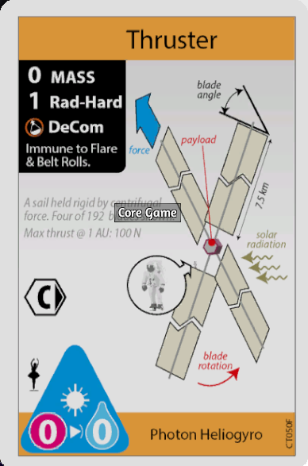
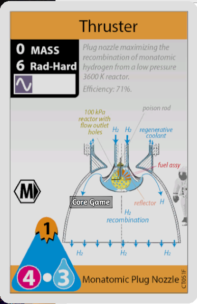

# High Frontier mission planner on steroid
This project is a fork of an already existing planner TODO by TODO.
This is a ~cheating tool~   ~fun killer~ mission planner for the board game [High Frontier](https://boardgamegeek.com/boardgame/281655/high-frontier-4-all). It can help you to find the best route from one place in the solar system to another. It's built in the browser, so there's nothing to download or install.

Original planner allowed  to find only the shortest path according to one, prespecified parameter. 
It also didn't allow to specify the spaceship configuration

My version is \(almost\) full simulation of spaceship movement and mission planning. 
It allows to specify multiple onboards engines which can be switched mid mission.
Additionaly, it finds and display all optimal paths.

[☞ **Open HF Mission Planner (4th Ed.)**](https://nornagon.github.io/hf-mission-planner)

## Usage

The tool will load with the view over Earth, where the air is free and the breathing is easy.
You can zoom the view with the scroll wheel, and pan by clicking and dragging.
To plan a path from one place to another, click the point you want to start from,
and the point you wish to end up at.
Information about the planned trajectory is shown in the top-right corner. 
In order to switch between found paths press <kbd>Left</kbd> and <kbd>Right<\kbd>.
Press <kbd>Esc</kbd> to clear the current trajectory (or just click on a new starting point to plan your next path).

### Specifying rocket configuration
Spaceship may have multiple working engines onboards \(the more, the slower the pathfinding\).
Each engine is described by 3 basic values: base thrust, fuel steps per burn, pivots.
Additionally, each engine may be solar-powered. Separate engines descriptions are separate by ';'

Example engines:

(0,0,1,solar)

(4,3,0)

Rocket using both engines:
(0,0,1,solar);(4,3,0)

### Optimal paths
Mission planner finds each path for each there is no better path.
For example, using rocket "(1,1,0);(10,10,0)" Luna can be reached from LEO in 2 years using 11 fuel steps or in 1 year using 20 fuel steps

### Hazards and belt rolls
For the sake of simplicity, I treat each hazard roll as one hazard, and each belt roll as 6-thrust hazards.
# Future work

## Spaceship
### Mass model

Currently, planner doesn't take under consideration mass of the spaceship. Each space-mission engineer knows, how important 
this should be and how funky mission may be planned by taking carefully tracking the weight loss and/or ditching half of 
the rocket in the orbit before landing.
### Afterburn
Not implemented.
### Rational fuel cost
Currently, fuel cost can be only expressed as an integer number instead of rational.

## Season and event tracking
No season tracking is currently supported. 
### Solar flares
Adding solar flares as special type of hazard could be very helpful.
### Implement the Solar Oberth flyby

Currently, the tool has no way to ask you for the thrust of your vehicle, so it can't calculate the bonus burns you'd get from performing a Solar Oberth maneuver. As such, the node is left unconnected on the graph currently. See [#9](https://github.com/nornagon/hf-mission-planner/issues/9).

Further, once we know the thrust of a vehicle, it's possible we could compute slightly more efficient paths by knowing the maximum number of burns per turn that a vehicle is capable of. Handling multiple engines with differing thrust is probably out of scope for the tool at present—if needed, you can plan two separate paths with different thrusts.

### Represent synodic sites

The tool currently assumes that every site is available at all times, which isn't true in the game. Some sites are "synodic sites", indicated on the map by blue, red or yellow outlines, and it's only possible to enter those sites during the relevant phase of the sun spot cycle. This is particularly relevant for the Venus flyby node, which the planner likes to use for all sorts of missions, but is actually only available 1/3rd of the time. See [#11](https://github.com/nornagon/hf-mission-planner/issues/11).
